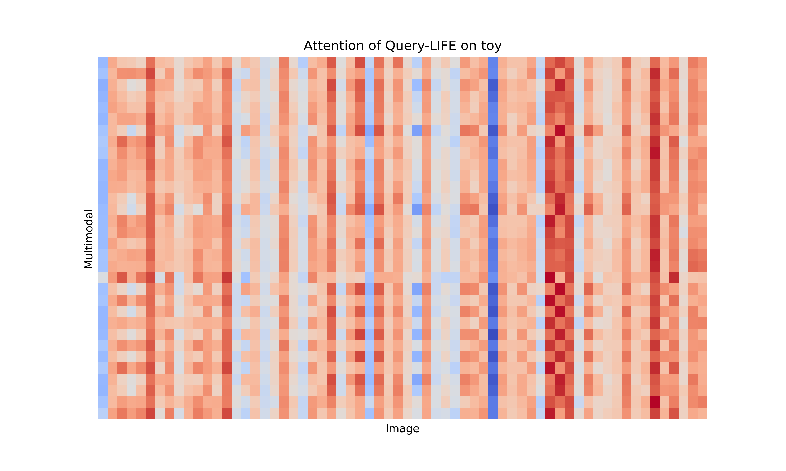
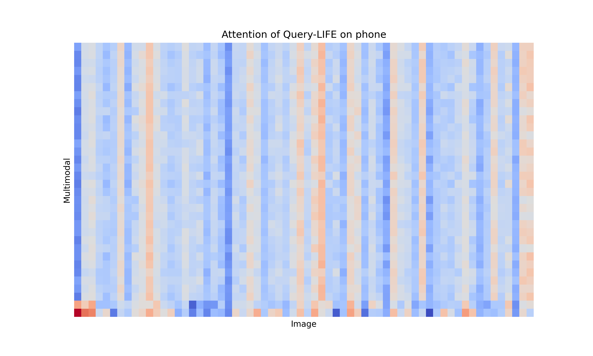
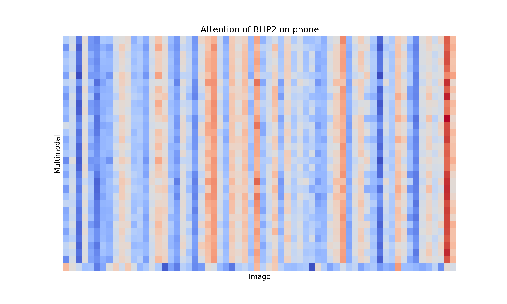

# Query-LIFE
#
## We take out crossattention and draw a heat map, where the abscissa is the image vector and the ordinate is the multi modal vector.

As shown in below Figure, in query-life's multi-modal vector of the toy product, most of the attention is focused on the image; while for the phone product, there are a few attention focused on image. On the contrary, blip2 maintains a relatively uniform attention distribution for toys and phones.

**Figure 1.** Attention of Query-LIFE on toy.

**Figure 2.** Attention of BLIP2 on toy.
#

**Figure 3.** Attention of Query-LIFE on phone.

**Figure 4.** Attention of BLIP2 on phone.

## demo of   different categories of products.

Query : green dress

Result:

#

Query : monitor

Result:

# 

Query : phone

Result:

# 

Query : laptop
Result:

# 

Query : toy
Result:

# 

Query : appliance
Result:

